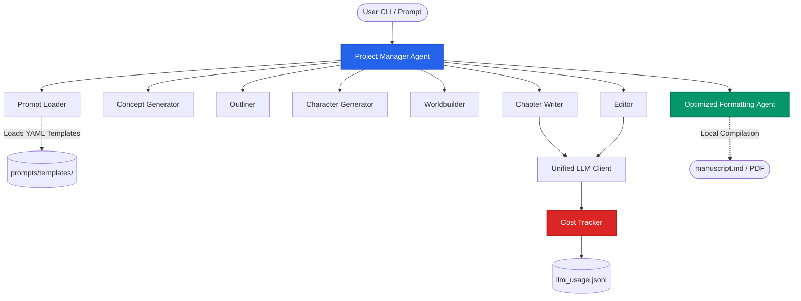

# LibriScribe 📚✨

<div align="center">


### Your AI-Powered Multi-Agent Book Writing Assistant

[](LICENSE)
[](https://guerra2fernando.github.io/libriscribe/)
[](CONTRIBUTING.md)
[](https://www.python.org/downloads/)
[](https://openrouter.ai/)
[](https://buymeacoffee.com/guerra2fernando)

</div>

---

## 🌟 Overview

**LibriScribe** revolutionizes book writing through a sophisticated multi-agent system. Specialized AI agents collaborate seamlessly to assist you from initial brainstorms and worldbuilding to draft generation, interactive editing, and local publication. 

With our latest integration updates, LibriScribe supports **OpenRouter routing**, fully customizable **external YAML prompts**, automated **LLM cost tracking**, and a **self-healing JSON parser** for unmatched writing reliability.


---

## 🏗️ Multi-Agent Architecture

LibriScribe orchestrates specialized agents guided by your configuration, loading prompts externally and logging execution costs automatically:



---

## ✨ Features

### 1. Unified LLM & OpenRouter Routing 🤖
*   **Multi-Provider Support:** Run on **OpenAI**, **Anthropic Claude**, **Google Gemini**, **DeepSeek**, **Mistral**, or any provider supported by **OpenRouter**.
*   **Intelligent Auto-Formatting:** Built-in JSON post-processing wrapper guarantees clean responses when routing through diverse models.
*   **Full Backward Compatibility:** Swap models dynamically without breaking existing templates or agent behaviors.

### 2. External YAML Prompt Templates 📝
*   **Fully Customizable Prompts:** 15 comprehensive agent templates isolated in `prompts/templates/`. Customize AI personas, vocabulary, and styles without editing python code.
*   **Dynamic Loading:** Auto-detects custom prompt modifications and falls back gracefully to hardcoded prompts if any files are missing.
*   **Genre-Specific Personas:** Easily configure suspense, scientific accuracy, or business tones directly inside templates.

### 3. LLM Cost Optimization & Tracking 💰
*   **Automatic Usage Logging:** Track execution metrics in `llm_usage.jsonl`. Logs timestamps, providers, selected models, precise input/output token counts, and USD cost calculations.
*   **Cost-Optimized Formatting Agent:** The compiler works **entirely locally** using local Markdown parsing and title-page assembly. This bypasses expensive LLM formatting calls, **saving ~$2.40 per manuscript!**
*   **Suggested Models Tiers:** Define high, medium, or low-cost model suggestions right inside prompt template settings.

### 4. Enterprise-Grade JSON Robustness 🔐
*   **Self-Healing AI Responses:** Automated prompt-repair attempts logic if raw JSON parse initially fails, ensuring agents heal malformed responses.
*   **f-String Safe Templates:** Fixed escaping issues to prevent code integration errors during runtime formatting.

### 5. Creative Writing & QA Suite 🎨
*   **Automated Outlining & Concept Creation:** Turn standard premises into rich narrative blueprints.
*   **Worldbuilding & Character Generation:** Generate complex multi-dimensional character profiles and coherent cultures.
*   **Chapter Writing & Refining:** Continuous draft-review cycles via an expert editing loops.

### 6. Local Retrieval & Knowledge Search 🔍
*   **Automatic Parsing & Chunking:** Auto-extracts character profiles, worldbuilding, summaries, and full chapters into searchable tokens.
*   **Exact Tag-Based Filters:** Constrain queries to specific documents (e.g., character profiles or outline sections) using exact filters.
*   **Robust Fallback Keyword Search:** Employs a sub-linear TF-IDF pure-Python search fallback if `rank-bm25` is not installed, requiring zero machine-learning dependencies.
*   **Automatic Cross-Reference Graphing:** Dynamically indexes co-occurrences of key characters and locations across all chapter chunks.

---

## 🚀 Quickstart

### 1. Installation

Clone and install LibriScribe locally:
```bash
git clone https://github.com/guerra2fernando/libriscribe.git
cd libriscribe
pip install -e .
```

### 2. Configuration

Create a `.env` file in the root directory and enter your API keys for the providers you wish to use:

```env
# Standard Providers
OPENAI_API_KEY=your_openai_key_here
OPENAI_MODEL=gpt-4o-mini

GOOGLE_AI_STUDIO_API_KEY=your_google_key_here
GOOGLE_AI_STUDIO_MODEL=gemini-2.5-flash

CLAUDE_API_KEY=your_claude_key_here
CLAUDE_MODEL=claude-3-opus-20240229

DEEPSEEK_API_KEY=your_deepseek_key_here
DEEPSEEK_MODEL=deepseek-coder-6.7b-instruct

MISTRAL_API_KEY=your_mistral_key_here
MISTRAL_MODEL=mistral-medium-latest

# OpenRouter Configuration
OPENROUTER_API_KEY=your_openrouter_key_here
OPENROUTER_BASE_URL=https://openrouter.ai/api/v1
OPENROUTER_MODEL=anthropic/claude-3-haiku

# Optional global fallback chain
# Entries may be provider names (use that provider's .env default),
# provider/model pairs, or model IDs for the current provider.
FALLBACK_CHAIN=claude,openrouter/anthropic/claude-3-haiku
```

LibriScribe reads these model values as provider defaults. In guided setup, Simple mode uses the `.env` default automatically, while Advanced mode lets you either keep the `.env` default or enter one custom model ID for the project.

Advanced mode can also optionally prompt you for a project fallback chain and per-agent fallback chains, giving guided setup parity with Expert mode without requiring a config file.

If `FALLBACK_CHAIN` is set, LibriScribe will try those routes when it hits a recoverable provider/model failure such as a timeout, 429, provider 5xx, empty response, or invalid JSON that could not be repaired.

### 3. Launch

To start the interactive prompt runner:
```bash
libriscribe start
```

Choose between:
*   🎯 **Simple Guided Setup:** Quick, streamlined guided book generation.
*   🎛️ **Advanced Guided Setup:** Fine-grained control over tone, target audience, and precise chapter goals.
*   ⚙️ **Expert: Configuration File:** Load a JSON or YAML setup file for repeatable, highly customizable runs.

You can also jump straight into Expert mode from the CLI:
```bash
libriscribe start --config examples/expert-config.yaml
```

### 4. Local Retrieval CLI
Manage and search your project's knowledge base and drafts directly:
*   **Rebuild index:**
    ```bash
    libriscribe retrieval rebuild --project my_project
    ```
*   **Refresh index incrementally (hash-based checks):**
    ```bash
    libriscribe retrieval refresh --project my_project
    ```
*   **Query the index (Keyword search):**
    ```bash
    libriscribe retrieval search --project my_project --query "Mira Thorn"
    ```
*   **Lookup cross-references & co-occurrences of an entity:**
    ```bash
    libriscribe retrieval xref --project my_project --entity "Castle Iron"
    ```

---

## 💻 Customizing Prompts

You can easily adjust the tone and focus of any writing agent. For example, to create a specialized Mystery Editor:

1.  Copy the default editor template:
    ```bash
    cp prompts/templates/editor.yml prompts/templates/my-editor.yml
    ```
2.  Edit `prompts/templates/editor.yml` to specify custom instructions and cost settings:
    ```yaml
    name: "Mystery Editor"
    cost_tier: "medium"
    settings:
      max_tokens: 4000
      suggested_models: ["openai/gpt-4o-mini", "anthropic/claude-3-5-sonnet"]
    template: |
      You are an expert mystery editor refining Chapter {chapter_number} of "{book_title}".
      Review content and emphasize clue placement, suspense, and red herrings.
      
      Feedback to address: {review_feedback}
      Chapter: {chapter_content}
    ```

The agent will automatically load and apply your customized template on its next run!

---

## ⚙️ Expert Configuration Files

Expert mode supports both JSON and YAML configuration files so repeat runs can be automated and reused.
LibriScribe also remembers the most recent expert settings and can offer them again on the next Expert run.

Expert mode currently supports:

- `libriscribe start --config <path>` for direct config-driven startup
- JSON and YAML project definitions
- reusable starter files in `examples/`
- project-level model selection with `project.model`
- optional per-agent model overrides with `project.agent_models`
- config-driven fallback routing with `project.fallback_chain`
- optional per-agent fallback routing with `project.agent_fallback_chains`
- workflow-stage controls for:
  - concept approval
  - outline review
  - character generation
  - worldbuilding generation
  - chapter writing (`prompt`, `auto`, or `skip`)
  - chapter error handling (`stop` or `continue`)
  - formatting and output format
- persisted recent expert settings in `.libriscribe_last_config.json`

Example:

```yaml
version: 1
project:
  project_name: my_fantasy_novel
  title: The Last Ember Gate
  category: Fiction
  genre: Fantasy
  language: English
  description: An exiled archivist discovers a buried gate tied to a fallen empire.
  num_characters: "3"
  worldbuilding_needed: true
  review_preference: AI
  book_length: Novel
  tone: Serious
  target_audience: Young Adult
  num_chapters: "10"
  llm_provider: openai
  model: gpt-4o-mini
  agent_models:
    outliner: gpt-4o-mini
    editor: gpt-4o
  fallback_chain:
    - claude
    - openrouter/anthropic/claude-3-haiku
  agent_fallback_chains:
    editor:
      - openai/gpt-4o
      - claude
workflow:
  concept_approval: auto
  outline_review: prompt
  character_generation: auto
  worldbuilding_generation: auto
  chapter_writing: auto
  chapter_error_mode: continue
  formatting: auto
  output_format: markdown
```

Starter files are available in:

- `examples/expert-config.json`
- `examples/expert-config.yaml`

When `project.agent_models` is provided, LibriScribe applies those model IDs only to the named agents and falls back to `project.model`, then to the provider default from `.env`.

Fallback entries support three forms:

- `claude` → use that provider's default model from `.env`
- `openrouter/anthropic/claude-3-haiku` → use an explicit provider/model route
- `gpt-4o` → use that model on the current project provider

If a fallback chain is configured, LibriScribe will move to the next route for recoverable failures such as timeouts, rate limits, provider 5xx responses, empty responses, or invalid JSON that still fails after repair. Fallback activity is logged so you can see which route ran next.

The `resume` command now inspects the saved project state, skips completed files, preserves existing chapter drafts, and continues from the next incomplete stage instead of assuming chapter-only recovery.

LibriScribe also writes a lightweight `.libriscribe_status.json` file inside each project so interrupted stages are tracked explicitly instead of relying only on file inference.

If `chapter_writing: auto` is enabled, LibriScribe shows a single summary confirmation before full-book generation begins, including a warning that the run may consume a large number of tokens / credits.

---

## 📁 Project Structure

A typical project created by LibriScribe looks like this:

```
your_project/
├── project_data.json          # Project metadata & configurations
├── .libriscribe_status.json   # Lightweight stage/checkpoint recovery state
├── outline.md                # Generated chapter-by-chapter outline
├── characters.json           # Multi-dimensional character profiles
├── world.json                # Worldbuilding details (category-specific)
├── chapter_1.md              # Generated and polished chapter drafts
├── chapter_2.md
└── research_results.md       # Research findings
```

All global execution costs and API calls are written directly to your workspace:
*   📂 `llm_usage.jsonl` - Real-time spend tracking and performance logging.
*   📂 `prompts/templates/` - External YAML files for 15+ specialized prompts.

---

## 🗺️ LibriScribe Development Roadmap

### 🤖 LLM Integration & Support
- [x] **Multi-LLM Support**: Anthropic Claude, Google Gemini, DeepSeek, Mistral, OpenAI
- [x] **Unified OpenRouter Gateway Integration**
- [x] **Cost Optimization Engine** (`llm_usage.jsonl` tracking + local manuscript compilation)
- [x] **Response Quality & Self-Healing JSON Parser**
- [x] **Automatic Model Fallback System**
- [ ] **Model Performance Benchmarking**

### 🔍 Vector Store & Search Enhancement
- [x] **Core Scaffolding & Local Keyword Retrieval** (Phase 0 + Phase 1)
- [x] **Local Entity Cross-Referencing & BM25/TF-IDF Fallback Search**
- [ ] **Multi-Vector Database Support**: ChromaDB, MongoDB Vector Search, Pinecone, Weaviate
- [ ] **Advanced Search Features**: Semantic Search, Hybrid Search (Keywords + Semantic), Cross-Reference Search
- [ ] **Embedding Models Integration**: Multiple Embedding Model Support, Custom Embedding Training

### 🔐 Authentication & Authorization
- [ ] **Cerbos Implementation**: Role-Based Access Control (RBAC), Attribute-Based Access Control (ABAC)
- [ ] **User Management System**: User Registration, Social Auth, Multi-Factor Auth, Session Management
- [ ] **Security Features**: Audit Logging, Rate Limiting, API Key Management

---

## 🤝 Contributing

We welcome contributions! Check out our [Contributing Guidelines](CONTRIBUTING.md) to get started.

```bash
# Verify imports and setup successfully before submitting a PR
PYTHONPATH=src python -c 'import libriscribe.main'
```

---

## 📄 License

This project is licensed under the MIT License - see the [LICENSE](LICENSE) file for details.

---

<div align="center">

Made with ❤️ by Fernando Guerra and Lenxys

[⭐ Star us on GitHub](https://github.com/guerra2fernando/libriscribe)

If LibriScribe has been helpful, consider buying me a coffee:

[](https://buymeacoffee.com/guerra2fernando)

</div>
